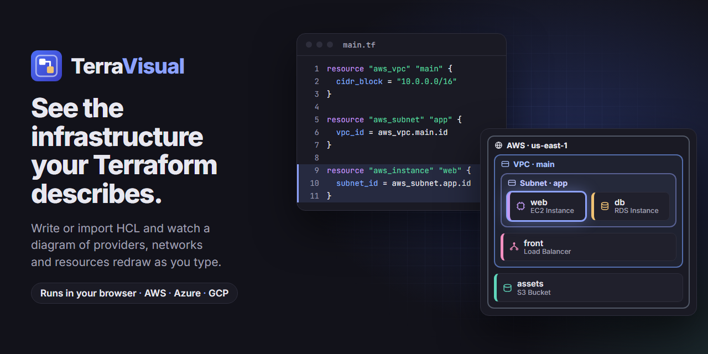
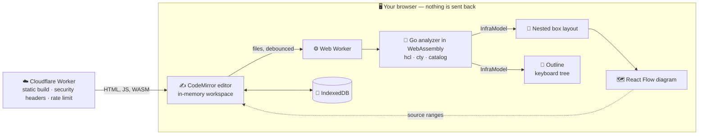

<p align="center">
  
</p>

<p align="center">
  <a href="https://github.com/Isma-L154/TerraVisual/actions/workflows/ci.yml"></a>
  <a href="https://github.com/Isma-L154/TerraVisual/actions/workflows/deploy.yml"></a>
  
  
  
  
</p>

<p align="center">
  <b>See the infrastructure your Terraform describes, as you write it.</b><br>
  An educational tool for people learning Infrastructure as Code. You write or drop in Terraform, and the diagram of what it describes redraws as the code changes — all inside your browser.
</p>

<p align="center">
  <a href="https://terravisual.cloudils.com">Live demo</a> ·
  <a href="https://github.com/Isma-L154/TerraVisual/issues">Report a bug</a> ·
  <a href="#running-locally">Run it locally</a>
</p>

---

## What it does

- **Your code never leaves your browser.** Parsing, evaluation and drawing all
  happen on the page, with no backend, database or account, so real Terraform —
  bucket names, internal CIDR ranges, account identifiers — is safe to open. The
  [privacy policy](https://terravisual.cloudils.com/privacy) and
  [terms of use](https://terravisual.cloudils.com/terms) say exactly what is and
  is not collected.
- **Start from an example.** *Examples* opens ready-made workspaces: an AWS web
  app, AWS serverless, an Azure virtual machine, a Google Cloud instance, and a
  root module calling a child module.
- **Bring your own project.** *Import project* takes a folder or individual
  `.tf`/`.tfvars` files, or drop them anywhere on the page. The folder you pick
  becomes the root module; state files and `.terraform` are skipped, and a
  report says what was imported and what was left out.
- **Work with files.** Create, rename and delete files from the bar above the
  editor, for instance to add `modules/network/main.tf` and watch it drawn
  inside the module's box.
- **Write with help.** Resource types complete from the catalog as you type
  `resource "`, brackets and quotes close themselves, and Ctrl+F (⌘F) finds and
  replaces.
- **Read the picture.** Click a box to see its attributes, including why an
  unknown value is unknown, and to jump to its code; moving the cursor in the
  code selects the box it is in. The *Outline* lists everything as a keyboard
  tree, and large workspaces fold loose resources behind counts and keep their
  networks visible.
- **Arrange the view.** Drag the line between the code and the diagram, or focus
  it and use the arrow keys. The diagram keeps everything in view until you pan
  or zoom it yourself.
- **Keep or share it.** *Save as PNG* exports the whole diagram. *Copy share
  link* puts the workspace inside the link itself, so anyone with the link has
  the code. Your work is kept in this browser between visits, and *Reset* goes
  back to the first example after asking.

Deliberately not in the MVP: remote modules, provider-schema validation,
resolved `data` sources, `terraform plan` visualization, accounts and
collaboration. The [architecture proposal](docs/architecture/architecture-proposal.md)
gives the reason for each.

## How it works



The analysis core is a Go module compiled to WebAssembly that reuses
[`hashicorp/hcl`](https://github.com/hashicorp/hcl) and
[`zclconf/go-cty`](https://github.com/zclconf/go-cty) — Terraform's own parser and
type system — rather than reimplementing the language. It runs in a Web Worker,
so analysis never blocks typing, and produces an `InfraModel`
([schema](schemas/infra-model.schema.json)), the single contract everything else
consumes. Two conventions run through it: a value that cannot be determined
without cloud credentials or a network fetch is reported as *unknown*, with the
reason, never guessed — a teaching tool that invents values teaches falsehoods;
and nodes, edges and diagnostics all carry exact source ranges, which is what
lets a click on a box highlight its code.

Terraform has no concept of containment, so which reference means "lives inside"
is decided per resource type in the [catalog](catalog/README.md) — data, not
code, covering AWS, Azure and GCP at comparable depth. The result is a nested
diagram (provider, region, network, subnet, resource) plus a curated set of
connections that teach something, rather than every reference the code contains.
Types the catalog does not know are still drawn, marked as uncatalogued: a real
project must never look empty, and must never look complete when it is not.
Providers are told apart by icon and text, not by colour alone.

**Stack:** Go 1.27 · hashicorp/hcl · zclconf/go-cty · WebAssembly · React 19 ·
TypeScript · Vite · CodeMirror 6 · React Flow · Cloudflare Workers

Design notes: [architecture proposal](docs/architecture/architecture-proposal.md) ·
[decision records](docs/adr/) · [Terraform function coverage](docs/reference/functions.md) ·
[testing](docs/testing/)

## Running locally

Needs **Go 1.27+** and **Node 22+** (CI uses Node 24). There is no database,
server or container to run.

```bash
npm install          # the web workspace; Go modules resolve on the first build
npm run build:core   # compiles the analyzer to WebAssembly into web/public/
npm run dev          # http://localhost:5173
```

There are no environment variables and no `.env` file to fill in: the
application has no backend and no secrets
([ADR-0001](docs/adr/0001-client-only-architecture.md)). `.env` files are
git-ignored all the same, and must never be committed.

| Command | What it does |
| ------- | ------------ |
| `npm run verify` | Generated-code drift, gofmt, `go vet`, Go and web tests, typecheck, lint, formatting and the build. Run it before opening a pull request |
| `npm run test:e2e` | Builds, then runs the browser suite and the performance budgets through the deployment Worker, under the production CSP. Needs `npx playwright install chromium` once |
| `npm run preview:worker` | Builds and serves through the real Worker on http://localhost:8787, security headers included |
| `npm run fuzz` | 30 seconds of fuzzing against the analyzer |
| `npm run generate` | Regenerates the TypeScript types and the Go copy of the catalog after a change to `schemas/` or `catalog/` |

Every command and the project's conventions are in
[docs/development.md](docs/development.md).

The banner is drawn in [docs/brand/banner.html](docs/brand/banner.html).
Regenerate it from the repository root with
`npx -y playwright@1.63.0 screenshot --viewport-size "1280,640" "file:///<absolute path>/docs/brand/banner.html" docs/brand/banner.png`.
The site's icons and link-preview card come from `web/public/favicon.svg` and
`web/brand/social-card.html` through `node scripts/make-brand-assets.mjs`.

## Deployment

A Cloudflare Worker serves the static build and sets the security headers
([ADR-0006](docs/adr/0006-hosting-cloudflare-workers.md)). The
[Deploy workflow](.github/workflows/deploy.yml) uploads a preview version for
each pull request, and deploys to production once CI has passed on `main`;
after either, `scripts/check-headers.mjs` verifies the headers on the real
response.
Production is https://terravisual.cloudils.com.

Repository secrets: `CLOUDFLARE_API_TOKEN` (a scoped token with *Workers
Scripts: Edit*) and `CLOUDFLARE_ACCOUNT_ID`, plus optionally `PRODUCTION_URL` so
the header check also runs against production. Without the token the workflow
skips with a notice rather than failing.

First-time setup — the `workers.dev` subdomain that preview URLs need, the spend
alert, and the dashboard settings no file in this repository can hold — is in
[docs/deployment/README.md](docs/deployment/README.md), along with rollback.

## Security

- **No secrets to leak.** Nothing in the code or the Worker needs one; the only
  secrets are the two deployment credentials, kept as GitHub Actions secrets.
  GitGuardian scans every pull request.
- **No CORS.** There is no API, and the Worker deletes any
  `Access-Control-Allow-Origin` header (`deploy/headers.ts`).
- **Hostile input is bounded.** The analyzer caps files (1000), source size
  (8 MiB total, 2 MiB per file), instances (1000 per resource, 20,000 in
  total), modules (200, nested at most 10 deep) and edges; an analysis that runs
  past 10 seconds is stopped by replacing the worker; share links are
  size-checked before and while they are decompressed.
- **Rendered as text, confined to the workspace.** `dangerouslySetInnerHTML` is
  banned by ESLint, module sources cannot resolve outside the workspace, and
  imports skip `.terraform` and state files, which can contain secrets.
- **Rate limited at the edge.** 1000 requests a minute per address, failing open,
  and [proven by tripping it](docs/deployment/README.md#the-rate-limit).
- **No database**, so row-level security does not apply; the workspace stays in
  the browser's IndexedDB.
- **A strict Content Security Policy, set from code.** `default-src 'none'`,
  `script-src 'self' 'wasm-unsafe-eval'`, a per-response style nonce,
  `connect-src 'self'`, `frame-ancestors 'none'`, `object-src 'none'` and
  `base-uri 'self'`, with HSTS, `nosniff` and `Referrer-Policy: no-referrer`,
  checked against the live response on every deployment. The one exception is
  `style-src-attr 'unsafe-inline'`, because React Flow positions nodes with
  inline style attributes.

The audits, including what they could not verify, are in
[docs/security/](docs/security/). Report a vulnerability privately as described
in [SECURITY.md](SECURITY.md).

## License

[Apache License 2.0](LICENSE).

TerraVisual builds on `hashicorp/hcl` and `hashicorp/go-cty-funcs` (MPL-2.0) and
`zclconf/go-cty` (MIT). Their file-level terms are compatible with this license
and apply to those files.
